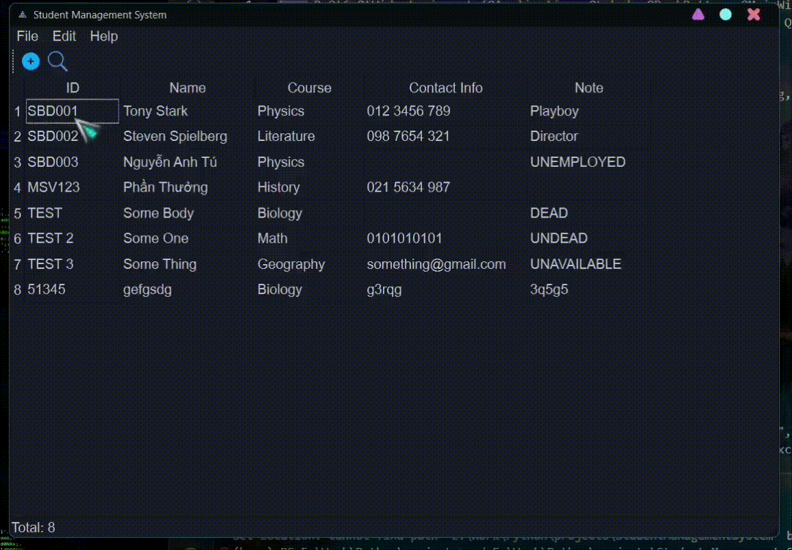

# Student-Management-System
A user-friendly GUI application designed to manage student records using SQLite database integration.

## Overview
Intuitive Interface: Student Manager boasts a clean and intuitive graphical user interface, making it accessible for users of all levels of technical proficiency.

Comprehensive Student Profiles: Each student record includes essential information such as student ID, name, course details, contact information, and additional notes, ensuring all pertinent details are easily accessible and organized.

Effortless Data Management: With the ability to add, delete, and edit student records, Student Manager simplifies the process of keeping your database up-to-date and accurate. The database file is saved locally so you don't need internet connection to access it.

Advanced Search Functionality: Quickly find specific student records using the search feature, allowing you to locate information with precision and ease.

Export Options: Student Manager offers versatile export capabilities, allowing you to convert your SQLite database to various formats including Word, Excel, PDF, and CSV. Whether you need to create reports, share information, or integrate data into other systems, Student Manager ensures compatibility and flexibility.

## Preview
This is a fast clip showing you how to add a student and what information a student would have in this database. Some information can't be leave blank like Name and ID.  
I have many other tutorial videos on how to use this application in the [Tutorial Videos](Tutorial%20Videos) directory.  

## Requirements
- Python 3.8 or higher
- PyQt6 (pip install PyQt6)
- docx (pip install python-docx)
- sqlite3 (Python's default library)
- pandas (Python's default library)
- reportlab (pip install reportlab)

  Open Command Prompt or PowerShell and type in `pip install <package name>`.

For the application to work on your computer, please change the path of `database.db` to its new path when you download my code to your computer:
- SMS.py: line 95
- actions.py: line 55, 95, 160, 191

## Note
This is only a basic and user-friendly GUI application that interact with the database file stored locally in your computer.  
I would've done a MySQL version but I didn't want to. Give me a request in the discussion about this if you still want a MySQL version of it, or even a C++ version.  
The process of making this application is inspired by: Ardit Sulce.  
